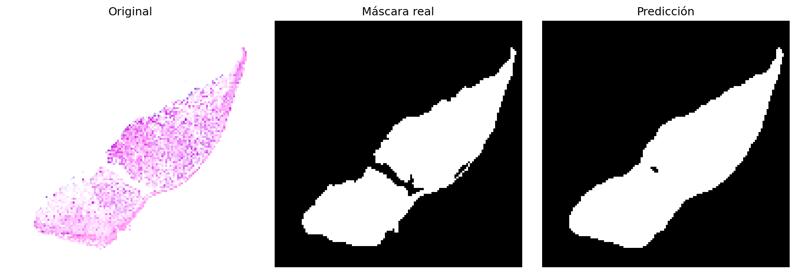

# M3_miniproject_UNet_SkinCancer_Segmenter
# Segmentación de Cáncer de Piel con U-Net

Este proyecto implementa un modelo de deep learning (U-Net) para segmentar automáticamente tumores de piel en imágenes histológicas. El sistema clasifica cada píxel como "tumor" o "fondo", estima el tamaño de la lesión y evalúa su precisión comparando con anotaciones de expertos.

## Dataset

Se utilizó el conjunto de datos público **Histopathology Non-Melanoma Skin Cancer Segmentation Dataset** [1], que contiene:

- **290 imágenes histológicas** teñidas con hematoxilina y eosina (H&E).
- **Máscaras de segmentación** anotadas manualmente por especialistas (píxeles blancos = tumor, negros = fondo).
- Tres tipos de cáncer de piel no melanoma:
  - Carcinoma Basocelular (BCC)
  - Carcinoma Espinocelular (SCC)
  - Carcinoma Intraepidérmico (IEC)

> Nota: El dataset no incluye distinción entre subtipos histológicos de BCC (ej. nodular vs micronodular), por lo que el modelo solo realiza segmentación binaria tumor/fondo.

## Metodología (¿Qué hace el código?)

El código está escrito en Python con TensorFlow/Keras y sigue estos pasos:

1. **Carga y preprocesado**
   - Lee las imágenes (`.tif`) y sus máscaras (`.png`).
   - Redimensiona todas las imágenes a 128×128 píxeles.
   - Normaliza los valores de píxel a [0,1].

2. **Arquitectura del modelo**
   - Red neuronal **U-Net ligera** (filtros reducidos para mayor velocidad).
   - Función de pérdida combinada: `dice_loss + binary_crossentropy` (mejor para manejar desbalance de clases).
   - Métricas: accuracy, MeanIoU.

3. **Entrenamiento**
   - 50 épocas con parada temprana (paciencia=8).
   - Reducción de learning rate si la pérdida se estanca.
   - Guarda automáticamente el mejor modelo (`.keras`).

4. **Evaluación y resultados**
   - Predice máscaras sobre el conjunto de validación (20% de los datos).
   - Calcula por imagen:
     - **IoU** (Intersection over Union) para tumor y fondo.
     - **Coeficiente de Dice** (similitud entre máscara real y predicha).
     - **Área del tumor** en píxeles.
   - Genera archivos de salida (Excel, CSV, figuras).

## Archivos de salida

El código crea una carpeta `Resultados/` con los siguientes archivos:

### 1. `resultados_segmentacion_YYYYMMDD_HHMMSS.xlsx`
Tabla con una fila por cada imagen de validación. Columnas:

| Columna           | Significado                                                                 |
|------------------|-----------------------------------------------------------------------------|
| `imagen`         | Nombre del archivo (ej. BCC_23)                                             |
| `IoU_tumor`      | Intersección sobre Unión para la clase tumor. Rango [0,1]; >0.95 es excelente. |
| `IoU_fondo`      | IoU para el tejido sano.                                                    |
| `Dice`           | Coeficiente de similitud (F1-score). También mide solapamiento.             |
| `area_tumor_px`  | Número de píxeles que el modelo clasificó como tumor (estimación del tamaño). |

### 2. `historial_entrenamiento_YYYYMMDD_HHMMSS.csv`
Registra la pérdida (loss), accuracy, MeanIoU y métricas de validación en cada época. Útil para graficar curvas de aprendizaje.

### 3. Imágenes de predicción (ej. `pred_BCC_23_20250612_143022.png`)
Figuras comparativas con tres paneles por imagen:
- **Izquierda**: imagen histológica original (H&E).
- **Centro**: máscara real (anotación manual).
- **Derecha**: máscara predicha por el modelo.

Estas imágenes permiten verificar visualmente la calidad de la segmentación.

## Ejemplo de resultados (BCC)

La siguiente figura ilustra el desempeño del modelo U-Net en una imagen de prueba BCC:

- **Original**: imagen histológica teñida con hematoxilina y eosina (H&E).
- **Máscara real**: anotación manual que sirve como referencia (blanco = tumor, negro = fondo).
- **Predicción**: máscara binaria generada por el modelo.

Como se observa, la predicción del modelo se superpone casi perfectamente con la máscara real. Las diferencias son mínimas y se localizan principalmente en bordes de regiones tumorales irregulares o en zonas de baja densidad celular, donde el modelo tiende a producir una segmentación más suave. Este comportamiento es consistente con las métricas cuantitativas (IoU y Dice > 0.95 en la mayoría de los casos).

## Limitaciones y trabajo futuro

- **Limitación principal**: el dataset no distingue subtipos de BCC (nodular vs micronodular), por lo que el modelo solo segmenta tumor/fondo. No puede clasificar riesgo clínico.
- **Trabajo futuro**:
  - Incorporar anotaciones más detalladas (centro del islote, palizada periférica, cleft peritumoral, estroma).
  - Extraer características de textura (GLCM) y usar clasificadores (SVM/Random Forest) para diferenciar subtipos.
  - Probar arquitecturas avanzadas (Attention U-Net) y mayor resolución espacial.

## Cómo ejecutar el código

1. Clona el repositorio y coloca las imágenes en `Images/` y las máscaras en `Masks/`.
2. Instala dependencias: `pip install tensorflow opencv-python tqdm scikit-learn pandas matplotlib`
3. Ejecuta el script principal (ajustando la variable `work_dir` con tu ruta).
4. Los resultados aparecerán en la carpeta `Resultados/`.

---
### Referencias (pagina web original del dataset)
[1] [Histopathology Non-Melanoma Skin Cancer Segmentation Dataset](https://espace.library.uq.edu.au/view/UQ:8be4bd0)
